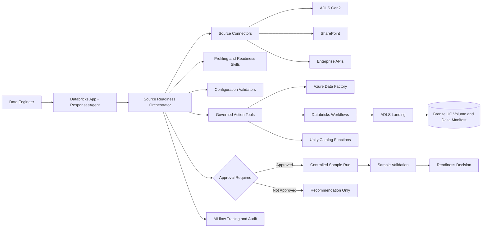

# Source Readiness & Pipeline Configuration Agent

A production-oriented MVP for assessing enterprise document sources before Azure Databricks onboarding. It profiles a bounded representative sample, reports unsupported and anomalous files, recommends ingestion and parser routing, generates a versioned configuration proposal, validates it deterministically, runs an approved sample, and produces audit-ready evidence.

This is an engineering control-plane agent, not a generic chatbot. Its boundary ends at source inspection, ingestion, ADLS landing, and immutable Bronze registration. It may inspect sample Silver results but never publishes production Silver, builds Gold assets, constructs domain knowledge graphs, or provides business-facing search.

## Architecture



Transport is isolated in `app.py` and `agent.py`. The orchestrator chooses a fixed operating mode; it cannot create tools dynamically. Services own use cases, deterministic skills own decisions, connectors are read-only, and action adapters enforce approval and idempotency in Python.

## Operating modes

| Mode | Outcome | Mutation |
|---|---|---:|
| `ASSESS_SOURCE` | connection, bounded inventory/sample, file/source profile, initial score | none |
| `GENERATE_CONFIGURATION` | disabled, versioned landing/Bronze/ingestion/parser/metadata/workflow proposal | proposal only |
| `VALIDATE_CONFIGURATION` | allowlist, naming, checkpoint, manifest, parser, security checks | validation record only |
| `SAMPLE_RUN` | approved idempotent ADF/Workflow dry or sample run plus metrics | approval required |
| `ACTIVATE_CONFIGURATION` | activate one validated version per source/environment | approval plus disabled feature flag |

Activation is disabled by default. No mode modifies, moves, or deletes source data or creates infrastructure.

## Connector model

`SourceConnector` exposes only `validate_connection`, bounded `list_objects`, `read_metadata`, bounded `read_sample`, and `estimate_inventory`. Implementations:

- `MockConnector`: complete local fixture implementation.
- `ADLSConnector`: `abfss://` parsing, account/filesystem allowlisting, `DefaultAzureCredential`, non-recursive bounded listing, and no writes. Production range-read wiring remains workspace-specific.
- `SharePointConnector`: safe pluggable boundary for an approved Microsoft Graph or enterprise adapter; no invented authentication.
- `SFTPConnector`: disabled by default; requires a host-key-pinned credential-provider adapter.
- `APISourceConnector`: boundary for an allowlisted, timeout/payload-limited, schema-validating adapter.

See [connector contracts](docs/connector_contracts.md).

## Tool and skill inventory

Deterministic skills cover signature/MIME checks, extension and size rules, metadata completeness, sampling, source aggregation, readiness scoring, ingestion selection, landing/checkpoint validation, parser eligibility, metadata profiling, and configuration generation. Governed tools cover repositories, UC permissions/volumes, Bronze configuration, ADF, Databricks Workflows, sample results, MCP, and explicit tool registration. Arbitrary SQL, Python, and shell tools are forbidden.

The LLM-facing prompt may recommend only. Pydantic validation and deterministic services decide whether a proposal or action is valid. Source content is treated as untrusted data, never instructions.

## Data contracts

All external and internal records use strict Pydantic v2 models (`extra="forbid"`). Primary contracts include `SourceDefinition`, `SourceObject`, `FileProfile`, `SourceProfile`, `LandingConfiguration`, `BronzeConfiguration`, `IngestionConfiguration`, `ParserRoutingProfile`, `MetadataProfile`, `ConfigurationProposal`, `SampleRun`, and `ReadinessAssessment`.

Metadata recommendations retain provenance: source-provided, deterministically derived, AI-inferred/requires-confirmation, or human-confirmed. Source-provided values are not overwritten. See [configuration contracts](docs/configuration_contracts.md).

## Readiness scoring

Default weights are connectivity 15%; format, integrity, metadata, landing, Bronze, and parser 10% each; inventory, checkpoint, workflow, governance, and sample result 5% each. Weights are policy data and must total one.

Blocking conditions override the score: inaccessible/disallowed source, no supported files, invalid landing path, checkpoint collision, missing ownership/Bronze target, no parser, excessive sample failure, or least-privilege violation. Statuses are `READY`, `READY_WITH_WARNINGS`, `CONFIGURATION_REQUIRED`, `ACCESS_BLOCKED`, `UNSUPPORTED_SOURCE`, `SAMPLE_RUN_FAILED`, and `NOT_READY`. Every category includes evidence and remediation.

Sample-run defaults require 100% accounting, 95% supported-file Bronze registration, 90% supported parsing, 98% manifest completeness, lineage references, recorded failure reasons, and explicit unsupported classification.

## Approval, activation, and versioning

Every action requires `approved=true`, `approval_reference`, `approved_by`, actor, reason, correlation ID, and deterministic idempotency key. A sample run also requires a deterministically validated proposal. Activation additionally requires a successful matching sample run and `ACTIVATION_ENABLED=true`.

Proposals are immutable versions. Changes create a new version with parent/change metadata. Only one version can be active per source/environment; prior versions stay auditable. Rollback means approved activation of a prior version, never mutation in place.

## Local setup

Python 3.11 is required.

```bash
python3.11 -m venv .venv
source .venv/bin/activate
python -m pip install --upgrade pip
pip install -e '.[dev]'
cp .env.example .env
make run
```

Local defaults are `APP_ENV=local`, `USE_MOCK_TOOLS=true`, and `ACTIVATION_ENABLED=false`. Check `GET /health` and `GET /ready`.

## Example assessment

```bash
curl -s localhost:8000/api/v1/assess-source -H 'content-type: application/json' -d '{
  "source": {
    "source_id": "SRC-POLICY-01",
    "source_name": "Policy Documents",
    "source_type": "MOCK",
    "source_system": "fixture",
    "connection_reference": "mock",
    "source_location": "mock://",
    "business_owner": "Policy Operations",
    "technical_owner": "Data Engineering",
    "expected_modalities": ["DOCUMENT", "IMAGE"],
    "expected_file_types": ["pdf", "docx", "png"],
    "ingestion_frequency": "DAILY"
  },
  "sample_policy": {"strategy": "HYBRID", "maximum_files": 25, "maximum_total_bytes": 524288000},
  "dry_run": true,
  "actor": "engineer@example.com"
}'
```

Representative response (IDs and exact scores vary):

```json
{
  "correlation_id": "CORR-...",
  "operation_mode": "ASSESS_SOURCE",
  "readiness_assessment": {
    "readiness_score": 73.5,
    "readiness_status": "CONFIGURATION_REQUIRED",
    "category_scores": {"connectivity_and_permissions": 100.0},
    "blocking_issues": [],
    "recommended_actions": ["Generate and validate a source configuration proposal"]
  },
  "approval_required": false
}
```

## Configuration proposal and validation

```bash
curl -s localhost:8000/api/v1/generate-configuration -H 'content-type: application/json' -d '{
  "assessment_id": "ASSESS-...",
  "target_environment": "dev",
  "desired_ingestion_schedule": "0 0 * * *",
  "allowed_parsers": ["databricks_primary", "azure_document_intelligence", "native_text_reader"],
  "actor": "engineer@example.com"
}'

curl -s localhost:8000/api/v1/validate-configuration -H 'content-type: application/json' -d '{
  "proposal_id": "PROP-...",
  "actor": "engineer@example.com"
}'
```

A proposal includes disabled ingestion configuration, append-only landing paths, distinct checkpoint/schema/quarantine paths, Bronze UC Volume and manifest mappings, SHA-256 registration, retry/DLQ rules, parser primary/fallbacks, metadata provenance, safe workflow parameters, version, actor, and audit timestamps.

## Controlled sample run

```bash
curl -s localhost:8000/api/v1/sample-run -H 'content-type: application/json' -d '{
  "proposal_id": "PROP-...",
  "sample_size": 25,
  "approval": {"approved": true, "approval_reference": "CHG-10001", "approved_by": "engineer@example.com", "reason": "onboarding validation"},
  "dry_run": true,
  "actor": "engineer@example.com"
}'
```

Representative result:

```json
{
  "operation_mode": "SAMPLE_RUN",
  "sample_run": {
    "status": "SUCCEEDED",
    "bronze_registered_count": 4,
    "parsed_count": 3,
    "unsupported_count": 1,
    "quality_summary": {"accounting_percent": 100.0, "registration_percent": 100.0, "supported_parse_percent": 100.0, "sample_run_score": 100.0}
  },
  "approval_required": true
}
```

## ResponsesAgent invocation

`POST /invocations` accepts a simple structured envelope or a Responses-compatible message whose text is JSON:

```json
{
  "input": [{
    "role": "user",
    "content": [{"type": "input_text", "text": "{\"operation_mode\":\"ASSESS_SOURCE\",\"payload\":{...}}"}]
  }]
}
```

The output uses a Responses-style completed response and includes `source_readiness_result`. Natural-language chat is intentionally rejected.

## Databricks deployment

```bash
databricks bundle validate -t dev
databricks bundle deploy -t dev
databricks bundle run source_readiness -t dev
```

The bundle contains dev/test/prod targets, App source, catalog permission, Workflow binding, model and MLflow variables. Before deployment provide governed catalog/schemas, UC Volume, operational Delta tables, App service principal/managed identity, least-privilege grants, Workflow job, model endpoint if AI enrichment is enabled, secret scopes/resource bindings, and MLflow experiment. See [deployment](docs/deployment.md).

## Azure integrations

ADLS uses `DefaultAzureCredential` and requires an approved storage account reference/container plus read/list RBAC and ACLs. Landing uses a separate write identity and append-only policy. ADF requires configured subscription/resource-group/factory references, approved pipeline names, and an identity allowed to validate/read/trigger/cancel runs. The agent never deploys pipelines or linked services. Auto Loader is never started inside the App; it emits validated notebook/job parameters.

## Unity Catalog, MCP, and MLflow

Production adapters should use Databricks SDK, managed MCP endpoints, or reviewed UC functions. App permissions should separate proposal creation from activation and grant only required catalog/schema/table/volume operations. MCP tools must label writes/actions, require approval context, and never embed bearer tokens. Reusable tools can expose profiling, landing validation, metadata generation, parser eligibility, readiness assessment, and proposal generation.

`trace_span` adds non-sensitive identifiers/status as MLflow attributes and excludes tokens, credentials, keys, and full file content. Structured logs apply defense-in-depth redaction. Production should configure an experiment and wrap connector/service/action calls with spans.

## Testing

```bash
make test
make lint
make typecheck
make check
```

The suite covers deterministic profiles, MIME mismatch, bounded sampling, blockers, strategy choice, paths, checkpoint uniqueness, parser eligibility, metadata provenance, approval, idempotency, state transitions, security controls, API contracts, and a complete local assessment-to-sample flow.

## Environment variables

See `.env.example`. Required production values depend on enabled adapters: `APP_ENV`, `USE_MOCK_TOOLS`, `ACTIVATION_ENABLED`, source allowlists, Databricks host/catalog/configuration/Bronze/operations schemas, UC bindings, Workflow job ID, model endpoint, MLflow experiment, ADLS account/container references, ADF subscription/resource-group/factory references, approved pipelines, timeouts, and sampling bounds. Credentials must come from Databricks resource bindings, secrets, managed identity, or `DefaultAzureCredential`, never environment examples or request bodies.

## Known limitations and workspace TODOs

- Bind the SharePoint Graph, SFTP, enterprise API, ADLS range-read, UC repository, permission, and Volume adapters to organization-approved implementations.
- Replace in-memory local persistence with operational Delta tables and reviewed UC functions.
- Bind and test ADF SDK calls and live Databricks Workflow status/cancellation/polling.
- Add the workspace approval-authority verifier; structural approval validation alone is not sufficient for production.
- Add content-aware complexity/scanned classification only through an approved endpoint with structured Pydantic output.
- Configure rate limiting, distributed idempotency/locking, telemetry retention, deletion of sample artifacts per policy, and external audit export.
- Verify `databricks.yml` resource syntax against the installed CLI/Apps release and organization policy.

## Security limitations and production-hardening checklist

- [ ] Replace all mock/in-memory adapters and run connector contract tests against non-production resources.
- [ ] Enforce canonical URI allowlists after DNS/redirect resolution for API and SharePoint adapters.
- [ ] Verify managed identities, ACLs, UC grants, schema isolation, and proposal/activation separation.
- [ ] Integrate a trusted change/approval authority and short-lived signed approval context.
- [ ] Use distributed idempotency and uniqueness constraints in Delta for concurrent App replicas.
- [ ] Add API authentication/authorization, request limits, rate limits, egress controls, and private networking.
- [ ] Red-team prompt injection, archive bombs, malformed documents, parser endpoints, logs, and traces.
- [ ] Define sample-artifact retention/removal, DLQ ownership, lineage SLAs, rollback, and incident runbooks.
- [ ] Pin a lock file/SBOM, scan dependencies and images, sign artifacts, and enforce CI coverage/security gates.
- [ ] Validate live Asset Bundle and Databricks App deployment in dev, test, and prod.

Additional design and operational detail is in [architecture](docs/architecture.md), [security](docs/security.md), and the [runbook](docs/runbook.md).
