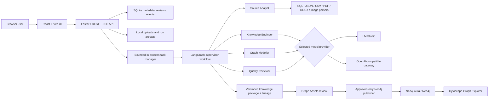

# Knowledge Graph Builder

Knowledge Graph Builder is a local-first application that turns database schemas, tabular data, documents, and images into reviewable knowledge assets and an explorable Neo4j graph. Runs execute in the background, preserve their progress and lineage, and can use either LM Studio or an authenticated OpenAI-compatible AI gateway.


## What the application does

1. Define the business question the graph should answer.
2. Upload structured and unstructured sources.
3. Launch a background extraction run and monitor each agent/tool step.
4. Inspect evidence, confidence, temporary outputs, and lineage.
5. Review generated entities and relationships before publishing them.
6. Publish approved assets idempotently to Neo4j and explore the result.

The repository is a proof of concept. It is suitable for local evaluation and extension, but its in-process worker and local storage are not intended to be a production multi-user deployment.

## Application tabs

| Tab | Route | Why it matters |
| --- | --- | --- |
| **Build** | `/` | Define the knowledge objective, upload sources, configure a run, save a draft, and send the work to the background queue. |
| **Run Queue** | `/queue` | Monitor queued/running/completed jobs. Open a run to inspect events, intermediate assets, errors, and lineage; cancel active work or delete a terminal run and its local assets. |
| **Graph Assets** | `/assets` | Review extracted concepts, entities, relationships, facts, and events with confidence and source evidence. Approve, flag for review, or reject before publication. |
| **Graph Explorer** | `/graph` | Explore the project-scoped graph published to Neo4j, traverse relationships, inspect provenance, and run guarded read-only Cypher queries. |

<details>
<summary>Graph Assets screen</summary>


</details>

<details>
<summary>Graph Explorer screen</summary>


</details>

## Architecture



Starting a run returns immediately. The backend task manager executes it with bounded concurrency while SQLite retains run state, events, intermediate-output metadata, and lineage. On an API restart, unfinished in-process jobs are reconciled rather than silently appearing active. Completed packages remain available for review.

## Quick start

### Prerequisites

- Python 3.12 or newer
- Node.js 20 or newer
- [`uv`](https://docs.astral.sh/uv/)
- one model endpoint: LM Studio **or** an OpenAI-compatible gateway
- optional: Neo4j Aura/Neo4j for publication and graph exploration
- optional: Tesseract for OCR of PNG/JPEG sources

From a fresh clone:

```bash
git clone <repository-url>
cd Data-Engineering-Dump-Box
./scripts/run-local.sh --install
```

The launcher creates `.env` from `.env.example` if it is missing, installs dependencies when `--install` is supplied, validates the selected model provider, and starts both services. Open:

- application: `http://127.0.0.1:5173`
- API documentation: `http://127.0.0.1:8000/docs`

Press `Ctrl+C` to stop both services. On later starts, dependencies are already present:

```bash
./scripts/run-local.sh
```

Validate configuration without starting anything:

```bash
./scripts/run-local.sh --check
```

Ports `8000` and `5173` must be available. The launcher reports an existing owner and exits; it never kills an unrelated process.

## Configure the model provider

Copy the environment template if the launcher has not already done so:

```bash
cp .env.example .env
```

Never commit `.env`. Select exactly one option below.

### Option A: LM Studio

Start LM Studio's local server and use the exact model identifiers returned by its `/v1/models` endpoint:

```dotenv
AI_PROVIDER=lmstudio
LMSTUDIO_BASE_URL=http://localhost:1234/v1
LMSTUDIO_ORCHESTRATOR_MODEL=your-loaded-model-id
LMSTUDIO_KNOWLEDGE_MODEL=your-loaded-model-id
LMSTUDIO_TIMEOUT_SECONDS=120
```

The two roles may use the same model. A smaller instruction model can make orchestration faster; a stronger structured-output model is usually more reliable for knowledge extraction.

### Option B: OpenAI-compatible AI gateway

Use this for a hosted model gateway, proxy, or self-hosted service that implements the OpenAI API shape:

```dotenv
AI_PROVIDER=openai_compatible
OPENAI_COMPATIBLE_BASE_URL=https://gateway.example.com/v1
OPENAI_COMPATIBLE_API_KEY=replace-with-your-secret
OPENAI_COMPATIBLE_ORCHESTRATOR_MODEL=provider/model-name
OPENAI_COMPATIBLE_KNOWLEDGE_MODEL=provider/model-name
OPENAI_COMPATIBLE_TIMEOUT_SECONDS=120
```

The application sends the key as `Authorization: Bearer <key>`. The gateway must expose `GET /models` and `POST /chat/completions`. Knowledge extraction requests OpenAI-style JSON Schema structured output; choose a gateway/model combination that supports `response_format.type=json_schema`. `POST /embeddings` is only needed when an embedding model is configured and used.

### Neo4j

Graph generation and asset review work without Neo4j. Configure it to publish approved assets and use Graph Explorer:

```dotenv
NEO4J_URI=neo4j+s://your-instance.databases.neo4j.io
NEO4J_USERNAME=neo4j
NEO4J_PASSWORD=replace-with-your-password
NEO4J_DATABASE=neo4j
```

See [Local setup](docs/SETUP.md) for manual startup and troubleshooting, then use the [demo runbook](docs/DEMO_RUNBOOK.md) for a complete synthetic procurement workflow.

## Supported inputs

| Category | Formats | Processing |
| --- | --- | --- |
| Structured | `.sql`, `.json`, `.csv` | Typed schema/tabular parsing and normalization |
| Documents | `.pdf`, `.docx` | Text extraction with source-level evidence |
| Images | `.png`, `.jpg`, `.jpeg` | OCR through Tesseract when installed |

Uploads are size-limited by `MAX_UPLOAD_MB` and stored beneath `UPLOAD_DIR`. Generated packages and intermediate files are stored beneath `ARTIFACT_DIR`.

## Current features

- Objective-driven Build workflow with drafts, reset, run summary, and responsive layouts.
- Background run queue with bounded concurrency, persisted status/history, cancellation, and cascading deletion of local run assets.
- Detailed progress events, agent/tool visibility, intermediate artifacts, confidence, evidence, and lineage.
- SQL, JSON, CSV, PDF, DOCX, and image/OCR source parsing.
- Supervisor planning and specialist Source Analyst, Knowledge Engineer, Graph Modeller, and Quality Reviewer stages.
- Structured-output validation, one corrective retry, quality scoring, and validation-driven re-planning.
- Canonical concepts, entities, relationships, facts, events, graph schema, and provenance models.
- Asset filtering, pagination, evidence inspection, and persistent approve/review/reject decisions.
- Approved-only, parameterized, idempotent Neo4j publication with publication history.
- Cytoscape graph visualization, search, filters, traversal depth, details, evidence, and guarded read-only Cypher.
- LM Studio and Bearer-authenticated OpenAI-compatible model providers with separate orchestration/knowledge model roles.
- Automated backend/frontend tests, synthetic fixtures, health indicators, and guarded demo reset tooling.

Deleting a terminal run removes its events, lineage, intermediate records, review/publication records, and generated local package. It deliberately does **not** delete graph data already published to Neo4j.

## Future features

These are roadmap items, not current capabilities:

- External durable workers and a broker-backed queue for multi-instance execution.
- Authentication, workspaces, role-based access control, and per-user audit trails.
- PostgreSQL/object storage backends and configurable artifact retention policies.
- Published-graph rollback/deletion with explicit impact previews.
- Managed deployment assets, secrets management, and horizontal scaling.
- Gateway-specific headers, OAuth/key rotation, rate-limit handling, and provider fallbacks.
- Expanded OCR/table extraction, chunking, multimodal models, and very large-file ingestion.
- Vector retrieval/RAG, graph version comparison, observability dashboards, and extraction evaluations.

## Verify the solution

Run the complete backend and frontend verification suite:

```bash
make test
```

This runs Pytest, frontend linting, the production TypeScript/Vite build, and Vitest.

## Project layout

```text
backend/                 FastAPI API, workflow, providers, persistence, Neo4j adapter
frontend/                React application and Cytoscape graph explorer
application_screenshot/  README and product reference screenshots
docs/                    Setup guide and end-to-end demo runbook
scripts/                 Local launcher and operational utilities
test/                    Synthetic knowledge-graph fixture pack
```

## Useful commands

```bash
make install       # install/synchronize backend and frontend dependencies
make local         # start both services through scripts/run-local.sh
make api           # start only FastAPI with reload
make web           # start only Vite
make test          # run all verification
make reset-demo    # preview and confirm deletion of local demo state
```

The OpenAPI route inventory and request/response schemas are available at `http://127.0.0.1:8000/docs` while the backend is running.
