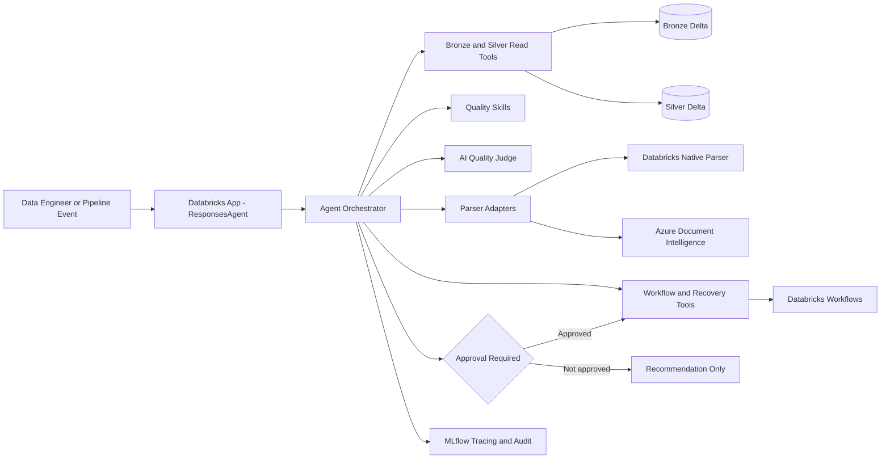

# Processing Quality, Recovery & Parser Optimization Agent

A production-oriented Azure Databricks agent for governing document processing between immutable Bronze files and quality-gated Silver outputs. It validates parser output, diagnoses failures, compares parser performance, plans bounded recovery, triggers only approved actions, verifies recovery outcomes, and proposes routing-policy improvements.

This is a data-engineering and platform-operations agent. It is not a consumer chatbot, RAG application, Gold-domain model, ingestion connector, or document-authoring tool.

## Architecture



The FastAPI/ResponsesAgent layer handles transport only. `AgentOrchestrator` owns state, correlation, evidence, approval, and tool audit. Services and skills contain domain decisions; tools isolate repositories, Workflows, MCP, and parser SDKs. Approval, state transitions, retry limits, URI allowlisting, SQL prohibition, and idempotency are enforced in Python rather than relying on a prompt.

See [Architecture](docs/architecture.md) for component responsibilities, runtime sequences, state transitions, immutability, and extension points.

## Operating modes

| Mode | Behavior | Production mutation |
|---|---|---:|
| `INVESTIGATE` | Load context, score output, diagnose failure, explain evidence | no |
| `RECOVER` | Investigate, plan, validate approval, create a new parser run, re-evaluate, record before/after | approved only |
| `COMPARE_PARSERS` | Rank parser quality, success, latency, cost, and stability | no routing change |
| `OPTIMIZE_POLICY` | Propose primary/fallback parser, thresholds, eligibility, and retry policy | applying requires approval |

## Repository layout

```text
.
├── README.md
├── pyproject.toml
├── app.yaml
├── databricks.yml
├── src/processing_quality_agent/
│   ├── app.py
│   ├── agent.py
│   ├── models/
│   ├── orchestration/
│   ├── services/
│   ├── skills/
│   ├── tools/
│   ├── prompts/
│   └── sql/
├── resources/
├── notebooks/
├── tests/
└── docs/
```

## Tool inventory

Read tools cover document context, Bronze manifests, parser runs/history, Silver documents/elements, quality assessments, batch failures, parser metrics, and bounded source samples. State-changing tools cover recovery attempts, Workflow triggers, processing status, review submission, quarantine, quality records, and routing policies.

Every live write requires actor, approval reference, approved-by identity, reason, correlation ID, and idempotency key. The agent has no arbitrary SQL tool. See [Tool contracts](docs/tool_contracts.md) for input/output, parser protocols, Workflow behavior, source access, UC SQL, MCP mapping, and errors.

## Data contracts

All public and internal contracts use Pydantic v2. Principal records are:

- `BronzeManifest`: source identity, URI, type, hash, batch, state, and lineage timestamps;
- `ParserRun`: parser/version/config, endpoint/prompt versions, status, latency, cost, warnings, and error;
- `SilverDocument`: normalized text, page coverage, layout/table/figure payloads, confidence, and source references;
- `SilverElement`: page element text, type, geometry, confidence, and source reference;
- `QualityAssessment`: metric scores/evidence, hard failures, final score, decision, and explanation;
- `RecoveryAttempt`: source/recovery runs, strategy/config, approval/actor, before/after quality, and outcome;
- `ParserComparison`: ranked component and overall scores;
- `HumanReviewRequest`: issue, severity, evidence, references, recommendation, ownership, and status.

Physical table names are configurable through `TableMappings`; code uses logical contracts rather than assuming organization-specific object names.

## Quality scoring

The final score combines deterministic evidence, normalized parser confidence, and an AI judge only when policy triggers it. Default weights are:

| Metric | Weight |
|---|---:|
| schema validity | 0.15 |
| page coverage | 0.15 |
| text quality | 0.15 |
| layout quality | 0.10 |
| table quality | 0.10 |
| metadata completeness | 0.10 |
| source-reference completeness | 0.10 |
| normalized parser confidence | 0.10 |
| AI judge | 0.05 |

When AI judgment is absent, its weight is redistributed by normalizing active weights. Hard failures override the numeric score. Unsupported or corrupt files cannot pass because of confidence or an LLM judgment. Decisions are `PASS`, `PASS_WITH_WARNINGS`, `RETRY_SAME_PARSER`, `RETRY_ALTERNATE_PARSER`, `HUMAN_REVIEW`, `QUARANTINE`, and `REJECT_UNSUPPORTED`.

The AI judge is intended only for threshold proximity, confidence conflict, parser disagreement, complex layout, ambiguous tables, missing semantic content, high-risk classes, or explicit investigation. Its structured result is advisory and cannot call recovery.

## Approval and recovery model

The agent is read-only by default. A live recovery without valid approval returns `AWAITING_APPROVAL` and no workflow run ID. Approval structure requires `approved=true`, approval reference, and approver identity; production must additionally verify the reference against the enterprise approval authority.

Default retry controls are one automatic retry per parser, three total attempts, no repeated identical parser/configuration after the policy limit, and human review after exhaustion. Recovery uses a deterministic idempotency key and always produces a new run/version plus an immutable attempt record.

## Local setup

Run from the repository root:

```bash
python3.11 -m venv .venv
source .venv/bin/activate
python -m pip install --upgrade pip
pip install -e '.[dev]'
cp .env.example .env
make run
```

Local defaults are `APP_ENV=local`, `USE_MOCK_TOOLS=true`, and dry-run enabled. Synthetic fixtures contain no real PII or PHI.

Health endpoints:

```bash
curl -s localhost:8000/health
curl -s localhost:8000/ready
```

## API examples

### Investigate

```bash
curl -s localhost:8000/api/v1/investigate \
  -H 'content-type: application/json' \
  -d '{
    "document_id":"DOC-102",
    "question":"Why did table extraction fail?",
    "include_source_sample":false,
    "dry_run":true,
    "actor":"engineer@example.com"
  }'
```

Representative result:

```json
{
  "operation_mode": "INVESTIGATE",
  "diagnosis": {
    "primary_failure": "TABLE_EXTRACTION_FAILURE",
    "retryable": true,
    "eligible_strategies": [
      "TABLE_FOCUSED_REPROCESS",
      "RETRY_WITH_ALTERNATE_PARSER"
    ]
  },
  "final_decision": "PASS_WITH_WARNINGS",
  "recommended_action": "TABLE_FOCUSED_REPROCESS"
}
```

### Approved recovery

```bash
curl -s localhost:8000/api/v1/recover \
  -H 'content-type: application/json' \
  -d '{
    "document_id":"DOC-102",
    "source_run_id":"RUN-101",
    "strategy":"RETRY_WITH_ALTERNATE_PARSER",
    "preferred_parser_id":"azure_document_intelligence",
    "approval":{
      "approved":true,
      "approval_reference":"CHG-12345",
      "approved_by":"approver@example.com"
    },
    "reason":"Recover missing policy tables",
    "actor":"engineer@example.com",
    "dry_run":false
  }'
```

The response includes source/recovery run IDs, plan, assessment, before/after score, outcome, tool audit, state history, and correlation ID.

### Parser comparison

```bash
curl -s localhost:8000/api/v1/compare-parsers \
  -H 'content-type: application/json' \
  -d '{
    "document_id":"DOC-102",
    "parser_candidates":["databricks_primary","azure_document_intelligence"],
    "quality_weight_profile":"BALANCED",
    "dry_run":true
  }'
```

The result is `RECOMMENDATION_ONLY`; it never updates production routing automatically.

## ResponsesAgent invocation

`POST /invocations` accepts a Responses-compatible `input` and typed operation fields in `custom_inputs`:

```json
{
  "input": "Explain the quality-gate failure.",
  "custom_inputs": {
    "mode": "INVESTIGATE",
    "document_id": "DOC-102",
    "dry_run": true,
    "actor": "engineer@example.com"
  }
}
```

The response contains a standard assistant message and structured `custom_outputs` with the complete `AgentOperationResponse`.

## Databricks deployment

```bash
databricks bundle validate -t dev
databricks bundle deploy -t dev
```

The bundle defines dev, test, and production targets and app resource placeholders. Production must bind a governed repository, service principal, catalog/schema, parser job IDs, policy files, MLflow experiment, and permissions. See [Deployment](docs/deployment.md) for prerequisites, all environment variables, UC objects, grants, Workflow binding, Azure setup, readiness, rollback, and the fail-closed production integration point.

## Azure Document Intelligence

The adapter uses `DocumentIntelligenceClient.begin_analyze_document` with configurable model ID such as `prebuilt-layout`. It prefers `DefaultAzureCredential`. API-key auth requires an explicit allow flag and secret injection; keys are never included in `.env.example` or logs. Results normalize pages, lines, tables/cells, geometry, references, latency, warnings, and structured failures.

## MCP configuration

The `MCPClient` protocol supports discovery and invocation without making MCP a local-test dependency. Production should connect managed Databricks MCP endpoints, allowlist discovered tool names, validate local schemas, propagate audit context, and preserve read/write classifications. Azure parsing may remain a local application tool or be exposed through a separately governed custom MCP server.

## Unity Catalog permissions

Use a dedicated app identity with `USE CATALOG`, `USE SCHEMA`, selected `SELECT`, specific `READ VOLUME`, `EXECUTE` on owned functions, narrow operations writes, parser job run permission, and MLflow experiment access. Do not grant unrestricted SQL, catalog ownership, broad Volume access, or Workflow editing.

## Workflow configuration

Map each parser ID to an approved Databricks job ID through `DATABRICKS_WORKFLOW_JOB_IDS`. Jobs receive document/source identifiers, parser/configuration, source run, recovery ID, and idempotency key. Polling is bounded with exponential backoff. A run must write a new Silver version rather than overwrite prior output.

## MLflow tracing and logging

Operation spans are created when MLflow is available and safely become local no-ops otherwise. Metadata is limited to identifiers, actor, environment, and operation mode. Responses record state and invoked-tool audit. Structured JSON logging redacts common secret fields. Production must configure trace retention, access control, sampling, and sensitive-content redaction.

## Testing

```bash
ruff check .
mypy src
pytest
# or all checks:
make check
```

The suite includes unit, integration, contract, and security coverage for scoring, hard failures, confidence normalization, AI-judge triggers, failure classification, retry exhaustion, parser ranking, approval, idempotency, state transitions, API/Responses contracts, Azure normalization, path traversal, arbitrary SQL rejection, secret redaction, and approved/unapproved recovery.

Databricks-compatible source notebooks provide table setup, UC-function registration guidance, smoke tests, parser benchmarking, and an MLflow evaluation seed dataset.

## Known limitations

- Production Delta/UC or managed-MCP repository is not implemented generically; startup fails closed when mock tools are disabled.
- Batch/run-only selector resolution requires a production repository resolver.
- Live AI-judge endpoint invocation is an extension point.
- Mock recovery materializes a synthetic immutable output version; production verification must poll governed Silver tables for the workflow's resulting run ID.
- Operation state and review queue are in memory.
- External approval verification and human-review UI are not connected.
- Provider pricing and production concurrency controls require workspace calibration.

## Production-hardening checklist

- Implement the governed repository and immutable audit store.
- Derive actor identity from authenticated ingress.
- Verify approvals against the enterprise authority.
- Persist idempotency and resumable operation state.
- Add row/column security and private networking.
- Calibrate policies with representative, labeled documents.
- Add provider concurrency, cost, and load controls.
- Configure alerting, retention, backup, rollback, and disaster recovery.
- Pin/scan dependencies and complete a threat model.
- Test denied operations, parser outages, workflow cancellation, and sensitive trace handling.

## Operational documentation

- [Architecture](docs/architecture.md)
- [Tool contracts](docs/tool_contracts.md)
- [Deployment](docs/deployment.md)
- [Security](docs/security.md)
- [Operations runbook](docs/runbook.md)
