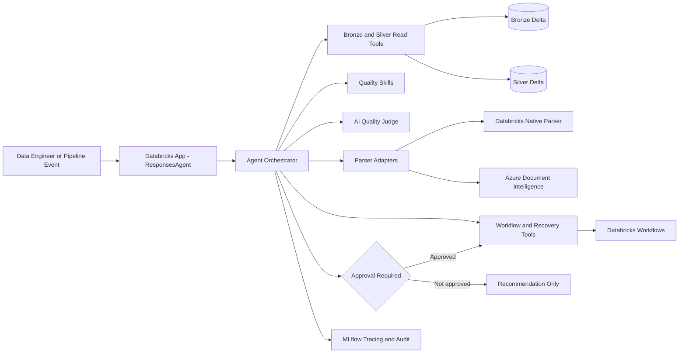

# Processing Quality, Recovery & Parser Optimization Agent

A production-oriented MVP for governing document processing between immutable Bronze files and quality-gated Silver outputs on Azure Databricks. It investigates failures, scores parser output, compares parsers, proposes routing policies, and performs only explicitly approved, idempotent recovery actions. It is an operations agent—not a consumer RAG chatbot.

## Architecture



The transport layer, explicit orchestrator, pure services/skills, governed tools, and parser adapters are deliberately separate. Critical controls—approval, state transitions, retry limits, URI allowlisting, SQL prohibition, and idempotency—are Python rules rather than prompt instructions.

## Operating modes

- `INVESTIGATE`: load context, evaluate quality, diagnose, and explain; no recovery.
- `RECOVER`: investigate, plan, require approval, trigger a new run, and verify the result.
- `COMPARE_PARSERS`: normalize historical or approved outputs and rank quality, success, latency, cost, and stability.
- `OPTIMIZE_POLICY`: propose primary/fallback routing and thresholds; applying requires approval.

Quality uses configurable deterministic metrics plus normalized parser confidence and a policy-triggered AI judge. If the judge is absent, its weight is redistributed across active metrics. Hard failures override the score. Every assessment returns metric evidence. Default decisions are `PASS`, `PASS_WITH_WARNINGS`, same/alternate retry, human review, quarantine, or unsupported rejection.

## Local setup

```bash
# Run from the repository root.
python3.11 -m venv .venv
source .venv/bin/activate
pip install -e '.[dev]'
cp .env.example .env
make run
```

Mock mode is `APP_ENV=local` and `USE_MOCK_TOOLS=true`. Run `make check` or `pytest --cov=processing_quality_agent`. Synthetic fixtures contain no PII/PHI.

## API examples

```bash
curl -s localhost:8000/api/v1/investigate -H 'content-type: application/json' -d '{"document_id":"DOC-102","question":"Why did table extraction fail?","dry_run":true}'

curl -s localhost:8000/api/v1/recover -H 'content-type: application/json' -d '{"document_id":"DOC-102","source_run_id":"RUN-101","strategy":"RETRY_WITH_ALTERNATE_PARSER","preferred_parser_id":"azure_document_intelligence","approval":{"approved":true,"approval_reference":"CHG-12345","approved_by":"engineer@example.com"},"actor":"engineer@example.com","dry_run":false}'

curl -s localhost:8000/api/v1/compare-parsers -H 'content-type: application/json' -d '{"document_id":"DOC-102","parser_candidates":["databricks_primary","azure_document_intelligence"],"quality_weight_profile":"BALANCED"}'
```

ResponsesAgent-compatible invocation:

```json
{"input":"Explain the quality-gate failure.","custom_inputs":{"mode":"INVESTIGATE","document_id":"DOC-102","dry_run":true}}
```

The response includes a standard Responses message and structured `custom_outputs` with correlation ID, evidence, assessment, diagnosis, state/tool audit, and recommended action.

## Databricks and Azure configuration

Required production resources are a Databricks App service principal, UC catalog and Bronze/Silver/operations schemas, governed Volumes, SQL warehouse or UC functions for typed reads/writes, per-parser Workflow job IDs, an MLflow experiment, and optionally a model-serving endpoint and managed MCP endpoints. Set:

- `DATABRICKS_CATALOG`, `DATABRICKS_BRONZE_SCHEMA`, `DATABRICKS_SILVER_SCHEMA`, `DATABRICKS_OPERATIONS_SCHEMA`
- `DATABRICKS_WORKFLOW_JOB_IDS` as JSON, and optionally `DATABRICKS_MODEL_ENDPOINT`, `MLFLOW_EXPERIMENT`
- `QUALITY_POLICY_FILE`, `ROUTING_POLICY_FILE`, retry limits, source allowlist, and feature flags
- `AZURE_DOCUMENT_INTELLIGENCE_ENDPOINT`, model ID, timeout, and auth mode

Prefer Azure/Databricks managed identity. To enable API-key fallback, set the explicit allow flag and inject the key via a Databricks secret/resource; it is never logged. Azure parsing uses `DocumentIntelligenceClient.begin_analyze_document`, bounded polling, and common-schema normalization for pages, lines, tables/cells, geometry, and confidence where available.

For MCP, configure managed endpoint discovery in a production `MCPClient`; map tools to the contracts in [tool_contracts.md](docs/tool_contracts.md). Grant `USE CATALOG`, `USE SCHEMA`, selected `SELECT`/volume read, and `EXECUTE` on owned functions only. Do not grant a generic SQL execution surface.

## Deployment

```bash
databricks bundle validate -t dev
databricks bundle deploy -t dev
databricks bundle run -t dev processing_quality_agent
```

Workspace-specific TODOs: implement the Delta/UC repository, choose SQL function vs Workflow vs serving endpoint for Databricks-native parsing, bind job IDs and app resources, configure approver validation against the enterprise change system, configure MCP endpoints, and add production principals/permissions to the bundle.

## Observability, limitations, and hardening

Structured JSON logs redact common secret fields. The app initializes an MLflow experiment, and operation outputs record tools and states. Production should wrap tool/service calls with workspace-supported MLflow spans, add trace sampling/redaction tests, and persist audit events transactionally.

Known MVP limitations: mock recovery reuses source context during verification; batch resolution, AI-judge model invocation, production Delta repository, external review UI, and managed MCP transport are extension points. The production startup path must fail closed until a governed repository is bound (the sample currently exposes that TODO explicitly).

Before production: threat-model prompt/tool boundaries; verify approval tokens server-side; use a durable idempotency store; add row/column controls; configure private networking; calibrate quality thresholds on representative data; load/cost test parsers; add alerting and disaster recovery; test cancellation/resume; pin and scan dependencies; and establish retention policies for traces and samples.

More detail: [architecture](docs/architecture.md), [deployment](docs/deployment.md), [security](docs/security.md), and [runbook](docs/runbook.md).
