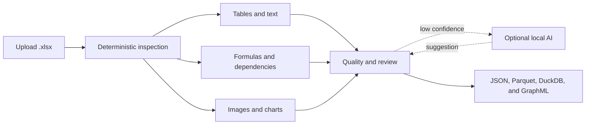

# Excel Intelligence

Turn an Excel workbook into a clear, searchable map of its data, formulas, and
structure—without sending the file to a cloud service.

**Local-first · macOS · `.xlsx` · Streamlit UI · Optional local AI**

[Quick start](#quick-start) · [First workbook](#your-first-workbook) ·
[Processing flow](#how-a-workbook-moves-through-the-app) ·
[Local AI](#optional-local-intelligence) · [API](#use-the-api) ·
[Development](#develop-and-test)

Excel Intelligence helps you answer questions that are surprisingly difficult
to answer by opening a workbook manually:

| Question | What the app produces |
| --- | --- |
| What is in this workbook? | Sheet inventory, visibility, dimensions, merged cells, comments, images, and charts |
| Where is the useful data? | Native Excel tables and inferred table regions exported to Parquet |
| How do the sheets connect? | Preserved formulas and a cross-sheet dependency graph |
| Which areas need attention? | Explainable region confidence, warnings, and a quality score |
| Can I review an ambiguous section? | A focused review screen with feedback and selective reprocessing |
| Can I search the extracted knowledge? | Optional local summaries, embeddings, and semantic search |

The deterministic pipeline works by itself. LM Studio and LibreOffice add
capabilities when available, but neither is required to inspect a workbook.

## Quick start

### 1. Install

You need macOS, Python 3.11 or newer, and
[`uv`](https://docs.astral.sh/uv/). From the repository root:

```bash
uv sync --extra dev
cp .env.example .env
```

### 2. Create the sample workbooks

```bash
uv run python scripts/create_sample_workbooks.py
```

### 3. Start the app

```bash
uv run streamlit run app/ui/streamlit_app.py \
  --server.address 127.0.0.1 \
  --server.port 8501
```

Open [http://localhost:8501](http://localhost:8501).

Choose **Try a sample**, select **Complex**, and click **Process workbook**. You
will get a five-sheet example with formulas, hidden sheets, a native table, a
chart, an image, comments, merged cells, and regions that need review.

<details>
<summary><strong>Install without uv</strong></summary>

```bash
python3.12 -m venv .venv
source .venv/bin/activate
python -m pip install -e '.[dev]'
cp .env.example .env
python scripts/create_sample_workbooks.py
python -m streamlit run app/ui/streamlit_app.py \
  --server.address 127.0.0.1 \
  --server.port 8501
```

</details>

## Your first workbook

The main screen offers two paths:

1. Select **Upload Excel** to use your own `.xlsx` workbook, or **Try a sample**
   to explore safely.
2. Click **Process workbook**. The original upload is stored unchanged.
3. Review the workbook score and extracted assets.
4. Open **Review & reprocess** for any low-confidence region.
5. Download table data or inspect the files written under `data/outputs/`.

The results are organized for exploration rather than implementation details:

| View | Use it to |
| --- | --- |
| **Sheets** | Find visible, hidden, and very hidden sheets and inspect sheet metadata |
| **Tables** | Preview native and inferred tables and download Parquet assets |
| **Formulas** | See expressions, cached values, and unsupported references |
| **Dependencies** | Trace which cells and ranges feed each formula |
| **Warnings** | Understand partial extraction, missing formula caches, or optional-service failures |
| **Regions & text** | Browse detected tables, titles, narratives, images, charts, and extracted text |
| **Review & reprocess** | Correct an ambiguous region without rerunning or overwriting the parent result |

## How a workbook moves through the app



Direct workbook inspection always runs first. The app uses OOXML and `openpyxl`
for facts that can be read from the file. Only a selected, bounded region can be
sent to the optional local agent. A failed optional step becomes a warning and
does not discard deterministic results.

## Private and safe by design

- Processing and storage stay on your computer.
- Uploaded workbooks are immutable; reprocessing creates a child run.
- Macros, workbook code, external links, and data connections are never run.
- Formula expressions are inspected, not calculated.
- LM Studio calls are restricted to its loopback address.
- Agent tools can read only the selected region and enforce cell and step limits.
- LibreOffice rendering uses a temporary copy and an isolated profile.

Formula cached values are preserved when Excel included them. If a cache is
missing, the expression and dependency information remain available and the app
records a warning.

## Optional local intelligence

The app is useful with no model installed. Local models can add three features:

| Capability | Setting | Behavior when absent |
| --- | --- | --- |
| Ambiguous-region review | `LLM_MODEL` | Region stays in the manual review queue |
| Image or rendered-region description | `VLM_MODEL` | Image is inventoried without an AI description |
| Semantic search | `EMBEDDING_MODEL` | Summaries remain available; vector search is skipped |

Start the OpenAI-compatible server in LM Studio, load the models you want, and
set their exact identifiers in `.env`:

```env
LM_STUDIO_BASE_URL=http://localhost:1234/v1
LLM_MODEL=your-local-instruct-model
VLM_MODEL=your-local-vision-model
EMBEDDING_MODEL=your-local-embedding-model
```

Restart Streamlit after changing `.env`. The sidebar reports whether LM Studio
is reachable and whether each capability is configured.

### Optional visual rendering

Install LibreOffice and enable rendering when you want a pixel view of a
selected worksheet region:

```env
ENABLE_LIBREOFFICE_RENDER=true
```

Rendering is refused for workbooks with detectable macros, external
links/connections, query tables, embedded packages, or potentially external
formulas. Deterministic extraction still completes.

## What gets created

Each processing attempt receives a run ID and a self-contained output folder:

```text
data/
├── uploads/<workbook_id>/<original_file>.xlsx
├── outputs/<run_id>/
│   ├── manifest.json
│   ├── metadata/
│   │   ├── workbook.json
│   │   ├── sheets.json
│   │   ├── regions.json
│   │   ├── table_assets.json
│   │   └── summaries.json
│   ├── tables/<table_id>.parquet
│   ├── text/text_assets.jsonl
│   ├── formulas/formulas.jsonl
│   ├── graph/dependency_graph.json
│   ├── graph/dependency_graph.graphml
│   ├── images/
│   ├── renders/
│   └── quality/quality_report.json
├── excel_intelligence.duckdb
└── runs.sqlite
```

| Format | Best for |
| --- | --- |
| **JSON / JSONL** | Inspecting metadata, formulas, warnings, and provenance |
| **Parquet** | Loading extracted tables into pandas, Polars, DuckDB, or analytics tools |
| **DuckDB** | Querying normalized assets across runs |
| **GraphML / graph JSON** | Exploring formula dependencies in NetworkX or graph tools |
| **LanceDB** | Searching region-aware text and summaries when embeddings are enabled |

Every asset retains its workbook, sheet, cell range, region, and run lineage.
The manifest includes counts, warnings, schema information, parent-run details,
and SHA-256 hashes.

## Use the API

The Streamlit app calls the processing pipeline directly. Run FastAPI separately
only when another tool needs programmatic access:

```bash
uv run uvicorn app.api.main:app --host 127.0.0.1 --port 8000
```

Open the interactive API documentation at
[http://localhost:8000/docs](http://localhost:8000/docs).

```bash
# Upload
curl -F 'file=@tests/fixtures/fixture_cross_sheet.xlsx' \
  http://127.0.0.1:8000/workbooks/upload

# Process the workbook_id returned above
curl -X POST \
  http://127.0.0.1:8000/workbooks/WORKBOOK_ID/process

# Inspect its regions
curl \
  http://127.0.0.1:8000/workbooks/WORKBOOK_ID/regions
```

<details>
<summary><strong>API endpoint reference</strong></summary>

| Method | Path | Purpose |
| --- | --- | --- |
| `GET` | `/health` | Application health and implemented phase |
| `GET` | `/system/status` | Local model, enrichment, and LibreOffice status |
| `POST` | `/workbooks/upload` | Store a validated `.xlsx` upload |
| `POST` | `/workbooks/{workbook_id}/process` | Run the complete pipeline synchronously |
| `GET` | `/runs/{run_id}` | Read persisted run metadata |
| `GET` | `/runs/{run_id}/status` | Read the current processing stage |
| `GET` | `/workbooks/{workbook_id}` | Read workbook metadata and its latest run |
| `GET` | `/workbooks/{workbook_id}/sheets` | List sheets and visibility |
| `GET` | `/workbooks/{workbook_id}/regions` | List regions and confidence |
| `GET` | `/workbooks/{workbook_id}/tables` | List native and inferred tables |
| `GET` | `/workbooks/{workbook_id}/text` | Read text, descriptions, and summaries |
| `GET` | `/workbooks/{workbook_id}/formulas` | Read paginated formula assets |
| `GET` | `/workbooks/{workbook_id}/graph` | Read the dependency graph as JSON |
| `GET` | `/workbooks/{workbook_id}/images` | List extracted image metadata |
| `GET` | `/workbooks/{workbook_id}/charts` | List charts and source ranges |
| `GET` | `/workbooks/{workbook_id}/summaries` | Read compact summaries |
| `GET` | `/regions/{region_id}` | Read one region and its feedback |
| `POST` | `/regions/{region_id}/feedback` | Save reviewer feedback |
| `POST` | `/regions/{region_id}/reprocess` | Create a child run for one region |
| `POST` | `/regions/{region_id}/render` | Render one region when enabled |
| `POST` | `/search` | Search configured LanceDB embeddings |

Processing is synchronous. Check the returned `stage` and `error` fields. The
API uses `422` for invalid input, `404` for unknown IDs, `503` for unavailable
optional services, and `409` for concurrent processing conflicts.

</details>

## Configuration

All configuration comes from environment variables. Start with
[`.env.example`](.env.example).

| Area | Common settings |
| --- | --- |
| Local storage | `DATA_DIR`, database and output paths |
| Upload safety | File-size and expanded-workbook limits |
| Extraction | Sheet, region, and cell caps; review confidence threshold |
| Local AI | LM Studio URL, model IDs, timeouts, agent steps, and tool-cell limit |
| Retrieval | Embedding model, chunk size, vector dimension, and search limits |
| Rendering | LibreOffice enablement, executable, and timeout |

Use one Streamlit process or one Uvicorn worker for each data directory. A file
lock protects workbook and DuckDB writes across the two interfaces.

## Current boundaries

- Input is `.xlsx`; legacy `.xls` files are outside the current scope.
- The app preserves and parses formulas but does not calculate them.
- Charts are inventoried; chart semantics and visual interpretation depend on
  optional enrichment.
- External, structured, 3D, dynamic, broken, array/data-table, and unresolved
  references are reported rather than guessed.
- Processing runs synchronously on the local machine.
- The quality score describes extraction confidence, not workbook correctness.

## Develop and test

```bash
uv run python scripts/create_sample_workbooks.py --output tests/fixtures
uv run pytest -q
uv run ruff check app scripts tests
```

The suite covers uploads, limits, hidden sheets, comments, merges, native and
inferred tables, formulas, named and cross-sheet references, dependency graphs,
manifests, migrations, images, charts, quality, selective reprocessing, bounded
agent tools, mocked and offline LM Studio, LanceDB search, rendering safeguards,
API errors, and Streamlit flows.

Four fixtures make common behaviors reproducible:

| Fixture | What it demonstrates |
| --- | --- |
| `fixture_simple.xlsx` | A small native table and straightforward formulas |
| `fixture_multi_region.xlsx` | Multiple logical regions on one sheet |
| `fixture_cross_sheet.xlsx` | Cross-sheet references and graph edges |
| `fixture_complex.xlsx` | Hidden sheets, names, comments, merge, image, chart, formulas, and review regions |

## Project map

```text
app/
├── ui/          Streamlit screens and review workflow
├── api/         FastAPI routes
├── services/    Upload, run, feedback, and orchestration services
├── pipeline/    Inspection, extraction, quality, enrichment, and retrieval
├── graph/       NetworkX dependency graph construction
├── storage/     SQLite, DuckDB, GraphML/JSON, and LanceDB adapters
├── agents/      Bounded LangGraph exception-resolution agent
├── tools/       Region-scoped workbook tools and safe rendering
├── llm/         Replaceable LM Studio client
├── models/      Typed domain and asset models
└── config/      Environment-backed settings
```

The local MVP implements all five phases defined in
[`CODEX.md`](CODEX.md): deterministic core, workbook structure, local UI,
agentic exceptions, and retrieval assets. The module boundaries keep storage,
graph, rendering, vector search, and model providers replaceable for future
enterprise deployments.
