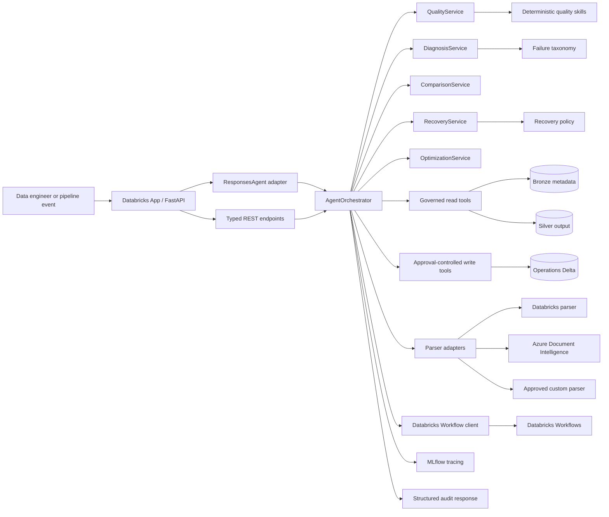
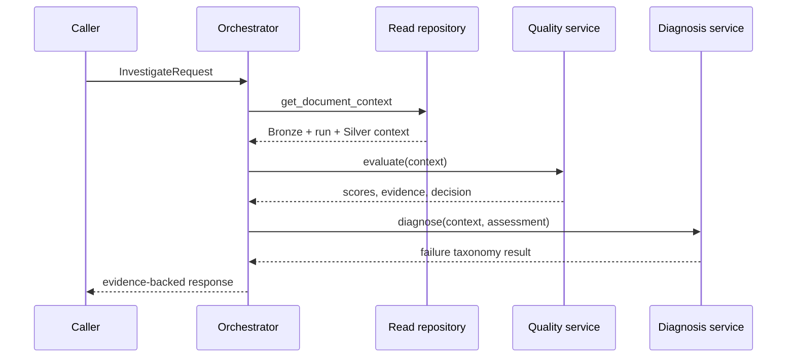
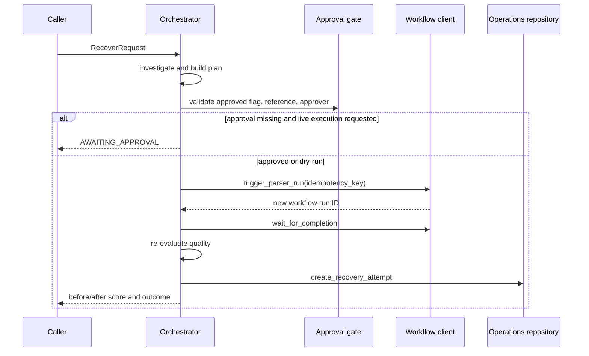

# Architecture

## Scope

The Processing Quality, Recovery & Parser Optimization Agent governs document-processing results between Bronze and Silver. It validates parser output, diagnoses failures, recommends bounded recovery, compares parser performance, and proposes routing policies. It does not implement consumer search, RAG, Gold-domain modeling, or source ingestion.

Bronze source binaries remain byte-for-byte immutable in governed Unity Catalog Volumes. Delta records carry file identity, lineage, parser runs, quality assessments, recovery attempts, benchmarks, and review work. A recovery always creates a new run/version; previous output is never updated in place.

## Component view

## Layer responsibilities

| Layer | Responsibility | Must not do |
|---|---|---|
| `app.py` | HTTP lifecycle, health endpoints, request/response binding | Make quality or recovery decisions |
| `agent.py` | Translate Responses-compatible input into typed operations | Bypass the orchestrator or call SQL |
| `orchestration/` | State transitions, correlation, approval gates, idempotency, tool audit | Mutate immutable source data |
| `services/` | Compose deterministic domain decisions | Access SDKs or credentials directly |
| `skills/` | Pure scoring, diagnosis, normalization, ranking, and planning | Perform writes or network calls |
| `tools/` | Isolate repositories, workflows, parsers, MCP, and state-changing operations | Accept unrestricted agent-generated SQL |
| `models/` | Pydantic v2 contracts for API, tools, services, and persistence | Contain infrastructure behavior |

## Runtime flows

### Investigation

Investigation is read-only. The local orchestrator does not persist its assessment during this mode, and it never triggers reprocessing.

### Approved recovery

Dry-run follows the planning path but does not create operational records or run a production workflow.

## State model

The explicit states are `RECEIVED`, `CONTEXT_LOADED`, `VALIDATING`, `AI_JUDGE_REQUIRED`, `DIAGNOSING`, `PLAN_GENERATED`, `AWAITING_APPROVAL`, `EXECUTING_RECOVERY`, `VERIFYING_RECOVERY`, `COMPLETED`, `FAILED`, and `ESCALATED`. `ALLOWED_TRANSITIONS` in `orchestration/state.py` rejects invalid jumps, including prompt attempts to move directly from receipt to execution.

Each response records:

- correlation ID and actor;
- invoked tool names;
- state transition history;
- quality evidence and decision;
- diagnosis and recommended action;
- resulting workflow run and recovery outcome when applicable.

The in-memory operation map supports local retrieval by correlation ID. Production should replace it with durable operational storage so a new app process can resume work.

## Data flow and immutability

1. Ingestion writes the source binary to a governed Volume and its identity to Bronze metadata.
2. A parser run reads the source and creates new Silver document/element records associated with a unique run ID.
3. The quality service evaluates the normalized output and emits metric-level evidence.
4. The quality gate either publishes, recommends recovery, routes to review/quarantine, or rejects unsupported content.
5. Recovery produces a new parser run and a separate `RecoveryAttempt` linking the source run to the recovery run.

No agent path overwrites source bytes or mutates a previous parser output.

## Extension points

- Implement a production repository backed by parameterized Databricks SQL, owned Unity Catalog functions, or managed MCP tools.
- Bind the Databricks parser adapter to an approved SQL function, Workflow job, or serving/function endpoint.
- Connect the AI judge only through a policy-triggered, structured-output service.
- Replace the in-memory review queue with a Delta repository or external review product.
- Persist orchestration state and idempotency keys for multi-process recovery and resume.

## Current MVP boundary

Local mode is complete and testable with synthetic data. Production mode intentionally fails closed until a governed repository is supplied. Batch/run-only selector resolution, live AI-judge invocation, durable resume, and external review UI integration remain workspace-specific work.
